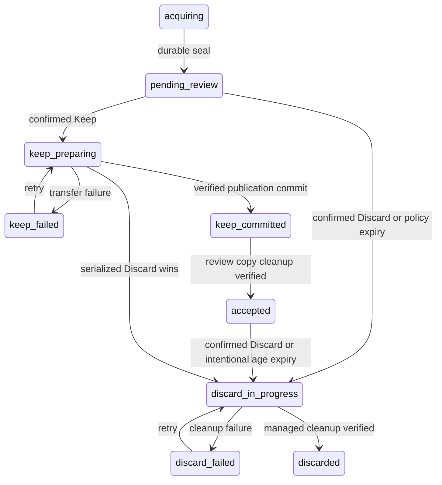

# Captured data control: proposed coverage contract

Design milestone, 8 October 2026. **Reviewable proposal, not implementation
authorization or a claim of enforcement.** ScreenWise remains an unsupported
developer fork with incomplete privacy/security validation and no guarantees.
Owner decisions in [DATA_CONTROL_DISCUSSION.md](DATA_CONTROL_DISCUSSION.md)
govern this proposal; [DATA_CONTROL_AUDIT.md](DATA_CONTROL_AUDIT.md) supplies the
source inventory. No captured contents, live stores/APIs, recording, builds,
model acquisition, firewall changes, deployment or publication were used.

## Evidence boundary and reconciliation

Started on branch `screenwise`, HEAD
`0a4c54f7239d5801b4b5074f5be2c0ea7165778b` (the audit commit). The index was
empty on entry. The discussion and capture diagnostics were untracked; capture,
audio, diagnostics, desktop and validation files had concurrent owner-authorized
edits. They were read as source where relevant and remain owned by the other
chat. This document alone is owned by this milestone. Source anchors refer to
this working-tree snapshot and named symbols; line numbers in the audit may move.

Rechecked `validate_raw_sql`/`execute_raw_sql` in
`crates/screenpipe-engine/src/routes/content.rs:543,598`, route registration in
`crates/screenpipe-engine/src/server.rs:434`, `delete_time_range` in
`crates/screenpipe-db/src/db.rs:6314`, file cleanup in
`crates/screenpipe-engine/src/routes/data.rs:46`, desktop `get_media_file` in
`apps/screenpipe-app-tauri/src-tauri/src/main.rs:245`, and persistent timeline
cache in `apps/screenpipe-app-tauri/lib/hooks/use-timeline-cache.tsx:9`.
The audit's bypass/shared-file/unlink findings still apply. Source search found
no persisted `pending_review`, `discard_in_progress` or `review_store` lifecycle
in the inspected Rust DB/engine/desktop directories; this is scoped source
evidence, not proof about every component. Audio `diagnostic_id` remains a
session-local ordinal (`crates/screenpipe-audio/src/core/device.rs:90`), and
Windows tree attribution still returns `MonitorUnverified`/`DifferentMonitor`
(`crates/screenpipe-a11y/src/tree/windows.rs:414-419`). Capture privacy permits
and diagnostic reasons do not constitute Keep approval. Final reconciliation
found the discussion committed as `33c785c54` and capture-policy source committed
as `3ea64c8c7ae3e0ad7bfc1fa77e4f2de1dbca5b31`. The key audited raw SQL, deletion DB,
file cleanup and desktop raw-media files were unchanged across those commits;
the working tree then contained only this document and the index was empty.
All explicit and matrix source-file anchors were checked for existence. Capture
diagnostics/microphone independence does not add retention lifecycle enforcement.
Reconcile again against the implementation baseline before implementation.

## Binding owner requirements versus proposed choices

Binding direction: separate review storage preferred; pending captured data and
derivatives withheld from ordinary consumers, including DigiTrack and Codex;
dedicated explicitly authorized local review may display them. Assistant review
requires separate explicit authorization for particular pending material. Keep,
Discard and Snooze are distinct. Discard includes source/group and derivatives
by default, is permanent after careful confirmation, has no undo, blocks access
immediately and reports persistent cleanup completion/failure honestly. Storage
pressure never forces deletion. Configured intentional age expiry is distinct.

The layout, state names, schemas, API status codes, bundle scope, failure recovery,
backup restrictions and rollout below are recommendations for owner review.
They do not silently resolve unresolved retention of existing material or grant
consent to narrower privacy, retained copies, rule migration or implementation.

## Storage choice and smallest enforceable initial selection

Recommend three application-owned areas: a content-free control ledger,
`review/` with its own database and media area, and `accepted/` with its own
database and media area. Internal relative paths only; ordinary consumers receive
opaque object IDs, never raw filesystem paths. Separate databases prevent ordinary
SQL from reading review rows, but **do not replace the common gate** for accepted
revocation, direct assets, events or caches. Local OS users can read their files;
this is an application access contract, not an OS adversary guarantee.

The initial scope is **everything in one or more complete sealed capture
bundles**, across all data types and data sources, including Multiple or Unknown
monitors and complete derivative closure. A bundle is a bounded acquisition
epoch with an explicit manifest of every record, raw chunk (including
untranscribed audio), file, temporary output and relationship. Writers rotate
files at epoch boundaries; no physical file crosses independently selectable
bundles or review/accepted stores. Exact bundle duration is an owner decision;
bounded short epochs are recommended, subject to codec/capture overhead review.
Bundle construction and closure are new work, not properties of existing files.

Initial Keep/Discard selects complete closed dependency components. Do not allow
multi-bundle shared elements, voice embeddings or summaries to join otherwise
independent components invisibly: prohibit such sharing initially, or present the
complete component for fresh confirmation. Persistent voice identity learning
from pending material must remain disabled until contribution lineage exists.
User-authored labels are independent only with explicit provenance. A derived
summary requiring multiple independently selectable bundles is deferred or
regenerated per bundle. This restriction requires owner review before feature
changes; it is not permission to remove current capabilities.

Automatic expiry must never expand from an expired bundle into a neighbor with
a later deadline or an accepted state. Phase 1 prohibits cross-bundle dependency
components for automatically expiring data. If migration or a detected violation
creates one, quarantine the component from release and report `expiry_scope_conflict`;
request an explicitly reviewed complete-component action, without deleting the
neighbor or silently changing its deadline. Snooze updates only the reviewed
selection's deadline. Until independent cleanup is proven, sharing blocks automatic
expiry completion; failure is visible rather than an authorization to widen scope.

Partial Keep/Discard of bundles, exact interval cuts, single monitor, microphone,
computer audio output, conversation and subtype overrides are **unsupported in
phase 1**. Preview returns `selection_not_isolatable`, actual extents and related
data types, with a proposed complete-bundle selection requiring a new confirmation.
Never silently round, widen deletion or keep extra material. If the owner declines,
no action occurs. Discard so far seals the active bundle, drains or invalidates
writers and shows its actual end before confirmation; future capture continues
in a new generation. It does not promise an exact arbitrary sample cutoff.

Eventual selectors preserve everything/all audio/microphone/computer audio
output/custom, visual and interface per monitor/all/Multiple or Unknown, broad
input and activity metadata. Conversation microphone/output can be grouped or
separate. Store acquisition origin, visibility, sampled foreground association,
causal association and derivative provenance separately. All monitors includes
Multiple or Unknown; do not relabel unknown as a selected physical monitor.
App-specific mixed output isolation and structure-only interface retention require
additional designs. Selecting activity without titles/URLs must enumerate retained
fields; structure can still contain content. Default derivative closure applies
unless a fine-grained override explicitly discloses retained material.

For future range splitting use UTC half-open `[start,end)`; point events belong
by their acquisition instant, audio by sample-extent overlap, frames by frame
extent/acquisition instant, transcripts by verified parent sample extents rather
than transcript row time. A crossing text segment without verified separable
alignment is indivisible. Estimated conversation boundaries are adjustable and
not verified membership. Discard conversation including remainder requires a
durable source/conversation suppression generation, with explicit end/resumption;
it must not suppress unrelated conversations inferred solely from time overlap.
Prior conversation/interval selections get the same isolation preview/refusal.

Legacy content cannot be promised bundle-complete: shared MP4, missing raw audio
extents, nullable memory provenance and speaker contributions block that claim.
Offer an explicit scoped migration inventory or refuse; never run global orphan
cleanup as an undisclosed extension of a selection. A whole-store Discard is
possible only after a complete owned-file/copy inventory and separately reviewed
confirmation, not merely a wide legacy SQL interval.

A central single-store fallback is not selected now. Cross-store copying can be
made recoverable and isolation has useful benefits. Consider fallback only after
measured synthetic implementation evidence shows disproportionate cost, and a
review demonstrates central eligibility across every matrix row, SQL views,
filesystem broker, startup and offline CLI. No temporary fallback may release
pending data or treat auth as approval.

## Lifecycle and invariants

The control ledger is authoritative; content stores hold projections. Store-wide
epochs and per-object generations accompany reads/writes. Unknown or unavailable
ledger state fails closed, with `control_unavailable`, not absence.

| State | Ordinary access | Authorized local review | Allowed transition |
|---|---|---|---|
| `acquiring` | Withheld; no content-bearing live events | Only scoped preview if expressly authorized | Seal to pending, or accepted under explicit Keep-by-default policy after durable registration; Discard |
| `pending_review` | Safe coverage/reason only | Selected content with review capability | Keep to `keep_preparing`; Snooze deadline; Discard/intentional expiry |
| `keep_preparing` | Withheld (`keep_in_progress`) | Pending selection, subject to leases | Verified transfer to `keep_committed`; failure to `keep_failed`; Discard |
| `keep_failed` | Withheld | Source only if intact and authorized | Retry same job; Discard; no automatic acceptance |
| `keep_committed` | Accepted projection only; source review copy inaccessible | Accepted content | Finish review-copy cleanup to `accepted`; failure remains visible; Discard |
| `accepted` | Released through shared gate | Accepted content | Discard/explicit accepted age expiry; no silent move back to pending |
| `discard_in_progress` | No content; `discard_in_progress` reason | No content, job status only | `discarded` on verified owned cleanup; `discard_failed` on failure |
| `discard_failed` | No content; failure status only | No content | Retry to `discard_in_progress`; never undo/Keep |
| `discarded` | Content-free tombstone/reason only | No content | Terminal; newly captured material has new IDs/generation |
| `recovery_blocked` | Withheld; `recovery_required` | Status only until integrity resolution | Return to proven previous state or continue Discard; never infer acceptance |

`keep_committed` records a publication commit; duplicate review-copy cleanup is
still owed. UI must say "Kept; review-copy cleanup incomplete" if necessary.
`discarded` means application-owned active records, files, tracked derivatives and
managed copies are verified removed. External-copy status and forensic-remnant
limits remain separately visible; it never means all historical bytes everywhere
are erased. Missing files can count as removed; inaccessible paths cannot.



The table also governs acquiring, keep_failed and keep_committed Discard and
integrity recovery, omitted from the diagram for legibility. No state transition
to Discard is an undo holding period. Immediate means the committed access fence
at confirmation, followed promptly by asynchronous permanent cleanup, not an
impossible promise of synchronous deletion from every device.

All derivatives inherit the most restrictive contributing state. Missing/unknown
lineage is quarantined, never presumed accepted. A kept reference cannot release
a pending anchor. Safe coverage is maintained independently of content tables,
so removing rows or an FTS hit does not erase the explanation. Registration must
precede content-bearing event publication. Capture admission remains a separate
gate; manual pause all recording, lock, schedule and source disablement survive.

## Proposed ledger/schema and transaction contracts

Names below are conceptual, not a migration patch. Content IDs are globally
unique across stores; current integer IDs need explicit mapping, never reuse.

| Relation | Required fields/constraints |
|---|---|
| `capture_bundle` | UUID, `[start,end)`, sealed flag, policy/version snapshot, state, generation, deadline UTC, revision, manifest version; no content/title/path |
| `data_source` | Durable opaque ID, kind, private device identity mapping and uncertainty; session diagnostics mapped explicitly, never used as durable ID |
| `content_object` | UUID, bundle, data type, source relations, acquisition extent, state/generation, internal locator, completeness; register raw files before transcript success |
| `lineage_edge` | Parent/child UUIDs, relation kind, contribution extent/field where verified, certainty; many-to-many, no untracked cross-store FK |
| `media_object` / `media_reference` | Owned relative locator, store, byte/sample/frame extent, codec, manifest integrity, all reference extents, writer lease, job ownership; no delete based solely on row count |
| `coverage_interval` | Safe source-class/type/time coverage and reason, attribution certainty; no text, labels, paths or existence inferred from a query term |
| `control_job` / `job_step` | Idempotency key, selection digest, expected revision, action, generation, durable step states, safe error code, retry schedule, remaining objects |
| `consumer_copy` | Managed consumer ID, copy ID, origin IDs/generations, acknowledged epoch, purge state; external/exported copies have explicit unverifiable status |
| `deadline_event` / `tombstone` | Deadline revision/reminder threshold/delivery state; minimal discarded object/generation and reason needed to prevent resurrection; retention of content-free metadata is an open decision |

Protected internal locators/device mappings are not safe API metadata. Ledger
tombstones must avoid turning the supposed content-free area into an activity
archive through titles, text hashes or identifiers meaningful outside the system.
Keep/discard previews use revision + manifest digest; changed contents or scope
invalidate confirmation. Idempotency keys replay the same action result, not a
new broader selection. Metadata revisions and action IDs are authorization scoped.

Cross-database Keep uses a durable saga, never pretends two SQLite commits are
one atomic operation: seal and lock selection; record intent; stage files/rows in
accepted area as nonservable; verify manifest, lineage, bytes and dependencies;
flush durable outputs; publish a ledger release commit plus generation; expose
only projections matching that commit; delete review copies and verify cleanup.
All writers/readers consult the ledger, so a crash after accepted DB insert but
before release still withholds it. Recovery completes only proven steps or cleans
unpublished staging. Missing sources/ambiguous manifests become recovery_blocked.
Staging rows/indexes must be physically separate from the ordinary eligible
search corpus, or equivalently isolated: filtering rows after FTS ranking does
not remove pending contributions to BM25/document frequency/suggestions/counts.
Accepted search order/scores/pagination must not change solely because pending
or unpublished staging content changes, apart from safe scope-derived coverage.
Eligibility must constrain candidate generation before rank/limit, not only outer
result rows. Current frame queries use `frames_fts MATCH ... ORDER BY rank LIMIT
5000` inside a candidate subquery (`crates/screenpipe-db/src/db.rs:7484,7859`);
withheld/revoked candidates must not consume those slots or influence ranking.
No cross-store numeric foreign keys; stable IDs and explicit projection mappings.
Discard serializes on the same dependency component and revokes staged outputs,
so a delayed Keep cannot publish after the Discard fence.

## Common access result and safe responses

All content reads use a shared `resolve_access(principal, capability, selection,
expected_generation)` result, including in-process/offline calls. Ordinary access
requires accepted/keep_committed, current release commit and accepted projection.
Review capability is locally granted, short-lived, scoped to selected IDs, action
and principal, separate from bearer auth; never inherited by DigiTrack/Codex/Pi,
generic viewer, browser bridge or ordinary rewind. Review bytes use no-store and
tracked temporary buffers. Assistant review needs a separate explicit grant for
specified items/time/data types; revocation/expiry purges managed tool buffers and
records copy obligations. The owner must settle capability grant UX.

Allowlisted ordinary withheld metadata: UTC start/end clipped to the authorized
requested interval, data type/source class, opaque authorized source ID if needed,
monitor attribution `one`/`multiple`/`unknown`, fixed reason, completeness and
available actions. No transcript, snippet, title, URL, app identity, speaker,
device label, file path, thumbnail, embedding, keyword-match count or sensitive
rule value. This contract deliberately narrows pending reason metadata; richer
per-frame diagnostic metadata remains independently protected, not automatically
released for pending content. Pending intervals in search derive from requested
time/type scope, never whether withheld text matches the query. Unbounded search
returns a scope-level withheld indicator and asks for a bounded interval rather
than revealing the entire pending history.

Proposed mixed interval response (200, with no-store):

```json
{
  "status": "partial",
  "content": [{"id": "accepted-object", "text": "Synthetic accepted transcript"}],
  "withheld": [{
    "start": "2026-10-08T00:10:00Z", "end": "2026-10-08T00:12:00Z",
    "data_types": ["audio", "transcript"], "source_class": "microphone",
    "reason": "pending_review", "actions": ["open_review"]
  }],
  "control_epoch": 42,
  "message_code": "accepted_content_with_withheld_coverage"
}
```

For a known pending transcript/frame/media ID, propose 423 with
`{"status":"withheld","reason":"pending_review","actions":["open_review"]}`
and scoped safe coverage. Explain: "Audio was captured during this period but is
pending retention review. Its transcript is withheld. Open review to Keep,
Discard or Snooze." Audio captured without successful transcription adds a
separate `transcription_not_available` observation; do not claim a transcript
exists. No 404/no-results substitution for known withheld data and no neighboring
frame fallback. Truly unknown IDs may be 404 without cross-principal existence
disclosure. Discard/Keep/recovery failures use their fixed distinct reasons;
capture suppression, no signal, acquisition failure and processing delay are
separate from retention state. An accepted-only empty result with complete
coverage can honestly be empty; incomplete coverage must be stated.

## Every audited exposure path: required enforcement

Abbreviations: `E` = `crates/screenpipe-engine/src/`, `D` =
`apps/screenpipe-app-tauri/`. All anchors below are source files/symbols rechecked
for existence; detailed audit line anchors remain in the audit. No surface was
exercised. **Common rule for every row:** acquiring/pending/Keep-in-progress
returns safe withheld coverage; accepted/keep_committed releases only current
eligible projections; Discard-in-progress/failed/discarded releases no content;
unknown/recovery fails closed. Review exceptions require the separate capability.

| Audited path / source anchor | Gate placement and regression obligation |
|---|---|
| Auth/vault, `E/server.rs`, `E/routes/vault.rs` | Auth + vault lock + lifecycle independently; upgraded sockets and local calls recheck all three |
| REST/keyword search, `E/routes/search.rs` | Before query/result/snippet/image and each TTL hit; accepted results plus scope-derived withheld coverage, FTS/count/tag leakage tested |
| Elements/context/suggestions/activity summary, `E/routes/elements.rs`, `E/routes/activity_summary.rs` | Every direct query and aggregation; no pending property/tree/name/count contribution; shared anchors checked |
| Frame image/text/OCR/metadata/context/next-valid, `E/routes/frames.rs` | Before cache, extraction, snapshot read, on-demand OCR or fallback; pending ID never substituted |
| HTTP frame browser cache, `E/routes/frames.rs` | Replace long-lived public asset semantics with mediated no-store; old cached copies tracked/limited, generation mandatory |
| Timeline stream/WS, `E/routes/streaming.rs`, `E/server.rs` | Initial/backfill/live/frame/nearby audio; check at dequeue and cancel queued stale payloads; emit reason coverage and revocation epoch |
| General events/client rebroadcast, `E/routes/websocket.rs` | Gate before publication and delivery, including partial/final transcript, text and images=true; unknown content payloads deny; client content needs provenance |
| Meetings/transcripts, memories/tags, speakers/samples/embeddings, `E/routes/meetings.rs`, `memories.rs`, `speakers.rs` | Verified lineage for every field and sample; mixed derivative withheld or regenerated from accepted parents; user-authored data explicitly classified |
| Raw SQL, `E/routes/content.rs::execute_raw_sql` | Replace ordinary arbitrary SQL with isolated approved read views and SQLite authorizer/connection restrictions; deny base tables, ATTACH, functions/virtual tables/schema/explain leakage outside allowlist. Reason coverage envelope required. Until implemented, raw SQL unavailable in review-enabled mode; this restriction needs owner approval |
| HTTP export, `E/routes/meetings.rs`, `E/meeting_export.rs` | Common core builds from authorized extents; mixed export contains accepted-only bytes plus separate safe withheld manifest, never black-box shared source file |
| Desktop export/offline CLI export, `D/src-tauri/src/meeting_export.rs`, `E/cli/export.rs` | Same core/ledger gate without daemon; acquire control lock or fail closed; independently tracked exported-copy manifest |
| DB backup, `E/routes/data.rs::backup_handler`, `E/cli/backup.rs` | Ordinary backup must exclude review and nonservable staging and sanitize accepted projection against ledger. Raw recovery backup is privileged maintenance, never ordinary consumer output; explicit pending/archive policy required |
| Offline CLI search, `E/cli/search.rs` | Shared eligibility and reason envelope; no direct ungated DB/no-results rendering for withheld coverage |
| Recovery/snapshot/pre-recovery archives, `E/cli/db.rs` | Owned archive inventory, release never from unvalidated restored DB; destructive cleanup cannot pretend archives absent. Pending-inclusive archive creation blocked until policy decided |
| Add/import/merge/retranscribe/media validation, `E/routes/content.rs`, `E/routes/retranscribe.rs` | Gate reads; writes carry parents/generation. Unknown import provenance quarantined. Arbitrary file path validation cannot bypass media broker |
| Browser bridge, `E/routes/browser.rs`, `E/server.rs` | Independent browser acquisition not automatically lineage; deny eval/bridge targeting review origins/tabs/webviews before executing JS. Review DOM/buffers must be isolated from ordinary bridge/automation, which could otherwise read already-authorized bytes without another API call. No review capability propagation |
| Desktop raw media IPC, `D/src-tauri/src/main.rs::get_media_file`, `D/lib/actions/video-actions.ts` | Replace supplied-path reads with object broker; no whole shared file release; path logs excluded from new notices |
| Audio blobs, `D/lib/hooks/use-audio-playback.tsx` | Only isolated accepted extents; stop playback/revoke blobs/purge buffers on fence and startup epoch mismatch |
| Direct frame/video assets, `D/components/rewind/hooks/use-frame-loading.ts`, `D/src-tauri/tauri.conf.json` | Remove ordinary raw capture-root asset access in favor of broker; scoped review separate. Asset protocol paths cannot confer permission |
| Viewer/markdown/attachments, `D/src-tauri/src/viewer.rs`, `D/components/markdown.tsx`, `D/components/meeting-notes/note-view.tsx` | Captured locators resolve through broker; generic local viewer is not trusted review; unrelated user files separately authorized |
| Persistent timeline cache, `D/lib/hooks/use-timeline-cache.tsx`, `use-timeline-store.tsx` | Origin+generation tags; block display before epoch handshake, purge stale localforage, including offline startup |
| Frontend stale cache, `D/lib/cache.ts` | Purge all matching stale/expired entries and displayed state; TTL is insufficient |
| Server search/image/extraction/hot/video caches, `E/routes/search.rs`, `frames.rs`, `data.rs`, `E/video_cache.rs` | Central invalidation for both retention and manual Discard; delete temp files; cache insertion and hit require current generation |
| Pi/local model, `D/src-tauri/src/pi.rs` | Ordinary tools withhold pending; tool results/chat/model output registered as managed copies where integration controls them; no assumption local model equals review consent |
| DigiTrack packets, `scripts/windows/evidence-review/EvidenceReview.psm1`, `docs/DIGITRACK_API_INTEGRATION.md` | Preserve safe reasons and coverage; consumer purge/ack protocol required. No downstream purge proof currently exists; no automatic assistant grant |
| Logs/panic artifacts, `E/crash_log.rs` and audited raw-media logging | New notices allowlisted/content-free; inventory managed diagnostic copies if content-derived. Historical content review is separately scoped; do not claim logs clean |

This matrix includes disabled/unregistered references only as noted in the audit:
the markdown `/experimental/frames/from-file` reference and browser cookies
handler are not asserted active endpoints. Future routes/types default deny until
registered in coverage tests; middleware alone is not the enforcement boundary.

## Lineage, byte ownership and deletion jobs

Required source closure includes snapshots/video → OCR/positions/full_text/FTS;
frame/tree → accessibility elements and shared anchors; raw audio → ordinary and
live transcripts, diarization/evidence/speakers/embeddings; captured input and
clipboard → verified causal captures and context; all contributing objects →
memories, summaries, tags/index entries, extraction artifacts and managed copies.
Meetings' titles, attendees, notes and segments are content; membership must be
verified separately from overlap. Global vocabulary/user-authored memories are
not automatically derivatives, but unknown provenance cannot be used to keep a
possibly captured contribution silently.

Mixed-source derivatives are withdrawn immediately when a contributing source
is discarded. Regenerate from retained parents into a new identity/generation,
without using discarded originals; if impossible, remove the derivative. Explicit
future overrides Keep text while Discard audio/image must disclose every retained
transcript/OCR/summary/embedding/copy and break only approved lineage edges.
Shared accessibility anchors must be duplicated into independently owned clean
objects or treated as an indivisible component; moving an anchor does not erase
its content. Voice embeddings require contribution lineage or removal/regeneration
of the affected embedding, with labels handled by explicit provenance decisions.

For future shared media surgery: isolate retained extents into a new file in
nonservable staging, verify that no selected samples/frames or embedded metadata
remain (codec preroll/keyframes included), fence reads, atomically publish clean
references, delete the original and all temp/extracted copies. A readable mixed
file cannot serve any ordinary whole-file request while containing pending or
discarded bytes. If exact surgery cannot prove isolation, refuse the fine selection
and offer an explicitly reviewed whole-file/component choice. Do not silently
remove retained neighbors or keep selected bytes. Phase 1 avoids this cost with
exclusive bundle files and references.

Discard job steps: resolve/freeze reviewed manifest and closure; commit irreversible
tombstones/access fence and increment generation; invalidate requests/queues and
copies; remove content rows/FTS and rewrite retained clean dependencies; best-effort
overwrite exclusively owned eligible files where practical; unlink files, staging,
temp and managed copies; verify absence/closure; record content-free completion.
Persist file ownership before removing DB locators. Jobs cover raw audio without
transcripts, failed inserts and tracked orphans independently of searchable rows.
Retries are idempotent with bounded backoff and visible safe failure codes, remaining
counts and next retry. Invalid ownership/path traversal/symlink escape is blocked,
never solved by broad deletion. Cleanup scans inspect registered metadata, not
unconsented captured contents.

The confirmation response succeeds only after the durable irreversible fence
commits. If the ledger cannot commit (full/read-only/corrupt), return an explicit
failure and immediately enter a global nonrelease latch: cancel content delivery,
block ordinary content reads and new capture, and keep review bytes closed. Do
not acknowledge Discard completion or silently continue serving the selection.
Persist a failure/recovery marker using reserved journal capacity if possible;
if that also fails, status must explicitly say the request was not durably recorded.
Every startup begins nonservable and runs a ledger writeability/integrity preflight.
Before any content access is enabled, durably arm a session marker in independent
reserved control storage; clear it only after clean shutdown with no unfenced
request. An unclean/armed restart or missing/untrusted journal requires explicit
owner reconciliation before reopening content if the failed selection cannot be
proven. No trace of a request means no claim to know its selection. A normal
automatic job recovery may proceed only when its durable fence is proven.
If even the initial armed marker cannot be persisted, content access never opens.
This conservative session interlock is an implementation acceptance dependency;
it includes offline CLI and desktop cache handshake, and ordinary repair cannot
erase/reset the marker to bypass reconciliation. If the selection was never
persisted, keep the affected store unavailable and require explicit action
re-confirmation. This trades crash-time availability for fail-closed access and
does not promise protection against filesystem rollback or lost durable writes.

No successful row count substitutes for byte removal. File locks, disk errors,
failed overwrite/unlink, DB commit failure, archive/copy purge failure and missing
lineage are separate status fields. Overwrite failure is reported independently
from successful unlink; policy for which failures block managed completion must
be settled, with best-effort overwrite never described as guaranteed forensic
erasure. SSD wear-leveling, journals/WAL, filesystem snapshots, backup history,
swap and external copies may retain remnants. SQLite checkpoint/vacuum is not
proof of secure erasure. No undo stash or newly created deletion backup.

## Managed consumers and external deletion limits

Managed responses/copies carry origin IDs, generation and control epoch; sensitive
content uses no-store. Publish durable `control_changed` events with safe tombstones
and resumable sequence. Managed consumers must stop playback/rendering/use at
receipt, purge text/images/blobs/exports/tool results/derivatives and acknowledge
copy IDs and epoch. Offline consumers reconcile before displaying caches; a lost
event forces epoch resync. Server refuses stale handles and stale writes. Managed
copy deletion failure blocks the corresponding completion claim and remains
visible. A consumer without purge/handshake support is not eligible for a promise
of managed Discard; disclose that limitation before enabling exports/integration.

Commit the copy ID, origins/generation and destination/consumer purge obligation
before the first byte leaves the access gate or a cache/export is materialized.
Couple registration to the current read lease; a concurrent fence cancels delivery.
Uncertain delivery after a crash remains an outstanding copy, not an assumption
that nothing was delivered. Managed consumers register child copies before creating
them under the same protocol and reconcile/purge outstanding obligations on restart.
Test crashes between registration, delivery, receipt acknowledgement and purge,
including concurrent Discard. External delivery also records its copy limitation
before release; inability to register blocks content delivery.

Already delivered bytes cannot be remotely erased by an HTTP predicate. External
DigiTrack stores, Codex conversation histories, manual exports, third-party backups
and copies outside application control have `purge_requested`, `acknowledged` or
`unverifiable` status, never fabricated proof. Assistant review authorization must
disclose these copy limits before pending content is supplied. External failures
remain visible alongside managed completion, not hidden inside a generic success.
No messages to consumers or assistant content access are authorized by this design.

## Restart, races, deadlines and storage operations

At startup, recover the ledger/journal and verify release projections **before**
starting content APIs, desktop cache display, offline CLI or content event delivery.
Apply due expiry fences first; reconstruct interrupted jobs; quarantine unknown
files/projections. Missing/corrupt ledger blocks access and capture with a safe
explanation. Restored backups must merge persistent Discard tombstones before any
release; if unavailable, require explicit recovery reconciliation, never resurrect
old accepted rows automatically.

Presence and integrity of some tombstones do not prove freshness: an old valid
ledger restored with old content can omit later Discard fences. Restoration must
consult a surviving current control authority/high-water mark outside content
backup rollback. Any control-ledger restore, unknown freshness or rollback enters
`recovery_blocked`; backed-up accepted/release flags are not current authority.
If that independent authority is also lost, require explicit reconciliation before
release. Tombstone compaction must preserve anti-resurrection proof; otherwise
every backup predating compaction becomes a reconciliation-only recovery input.
Test restoring old content and an old valid ledger together.

Read leases serialize with the access fence: check before opening, before each
stream delivery and before returning buffered output. Cancel/drain active leases
at confirmation; bytes already delivered are governed by copy obligations. Workers
for transcription, compaction, OCR, import, summaries and caches carry the starting
generation, stage outputs and compare-and-swap before publish. Stale outputs are
destroyed, not retried against a new generation. Capture creates new bundle IDs;
Discard remainder suppression survives restart. Race tests must include a file
created after source rows disappear and a compactor that read before Discard.

Recommend review deadline = sealed capture end + configured hold (for example
seven days), clearly displayed in local time, stored in UTC. Snooze 2h/1d/3d/7d
extends from the later of current deadline and now; custom date/time must be later
than both, with daylight-saving ambiguity resolved visibly. Unlimited repeats;
revision each change; reminders 3d/1d/2h recalculate, skip passed thresholds and
deduplicate by deadline revision. Exact baseline/custom-date semantics require
owner approval. Keep-by-default creates accepted content only under an explicit
policy snapshot; never retroactively applies to existing pending content.

Recommend configured pending expiry fences on next startup even after offline
deadline, and then retry permanent cleanup; warning failure does not silently
extend the deadline. This recommendation requires owner decision on expiry consent
and clock safeguards. UTC wall-clock change/untrusted clock pauses destructive
expiry for reconciliation with a visible safe warning; monotonic time helps within
one run but cannot prove offline elapsed time. Keep/expiry/Snooze serialize on
deadline revision; action already fenced for Discard cannot be snoozed or kept.
Accepted age retention uses its separately enabled policy and complete scope;
media-only eviction remains storage reclamation, preserving text by design and
never labeled Discard. No current worker silently changes policy or uses its
one-hour batches as review boundaries.

Storage pressure prompts voluntary Discard with the same preview/confirmation.
It never shortens review deadlines or invents age expiry. Low-space operation
reserves bounded control-ledger/journal/notices capacity outside capture allocation;
refuse new capture before that reserve is consumed. Stop affected capture on
exhaustion, alert in tray details and persist safe onset/source/reason/resumption
where possible. If all storage is full or persistence fails, retain bounded
in-memory state and expose `status_persistence_failed`; do not promise persistence
on a physically full volume. Keep duplication may require substantial free space:
preflight bytes, refuse safely and keep pending without auto-Discard. Cleanup jobs
must work with bounded extra allocation; split/reencode requiring unavailable space
fails visibly. Storage usage includes review, staging, managed copies and cleanup
backlog. UI starts with tray details; floating panel remains deferred.

## Migration and rollout gates

1. **Owner design review:** settle decisions below and reconcile concurrent source.
   No implementation authorization inferred from this milestone.
2. **Synthetic foundation:** ledger, manifests, raw acquisition extents, exclusive
   bundle files and provenance first; implement recovery and nonrelease projections.
   Enumerate imports/user-authored artifacts and all managed file roots explicitly.
3. **Complete boundary:** mediate DB/core/CLI, SQL, IPC/assets, streams, exports,
   caches and review capability. Deny unconverted paths in review-enabled mode
   only after owner approves the capability restriction. Prove every matrix row.
4. **Lifecycle:** Keep saga, Discard closure/jobs/copy acknowledgements, deadline
   revision/Snooze and storage-stop explanations. Expose tray controls only once
   promised enforcement is demonstrable. Preserve independent visual/microphone
   policy and explicit pause all recording.
5. **Explicit legacy migration:** source-only schema inventory first; reading or
   relocating actual captured material requires new scoped authorization. Show
   old content policy, missing provenance, shared files/archives and proposed
   accepted/pending classification; never mark legacy content accepted by default
   or auto-expire it. Dry-run manifests and resumable verified moves precede cutover;
   fail closed on unmigrated roots. Recovery planning cannot reintroduce discarded
   material. No destructive migration approved here.
6. **Fine selections later:** verified per-source extents, sample/frame surgery,
   many-parent lineage and conversation membership before monitor/audio/subtype
   controls. Preview all kept overrides and refusals. Rule/exclusion migration
   uses **Use Codex**, inventories old/new scope and requires explicit decisions;
   visual exclusions remain independent from microphone and manual all-pause.

## Acceptance and regression contract

Implementation evidence should use synthetic content with distinct markers for
accepted, pending and discarded objects, never the owner's captures. Tests must
assert actual payload/bytes/remaining derivatives and reasons, not just row counts.

| Criterion | Minimum regression cases |
|---|---|
| Complete withholding | Each exposure matrix row, pending-only/mixed/empty/unknown/recovery state; query-term independence; auth/vault combinations; no raw path or cache bypass |
| Review boundary | Ordinary DigiTrack/Codex/Pi and generic viewer denied; scoped local grant/expiry/revocation; assistant grant never inferred from ordinary auth |
| Bundle selection | Raw no-transcript audio, file-only failed insert, all types/unknown monitors; active sealing; declined widening leaves data untouched; unsupported fine selection explicitly refused |
| Lineage closure | OCR/full_text/elements/FTS, shared anchors, live/ordinary transcripts, memories/mixed summaries, speaker embeddings/evidence, clipboard causal captures and managed copies |
| Byte isolation | Shared MP4/audio before/inside/after proposed cut, codec preroll and transcript crossings; no neighboring bytes; missing alignment refuses; no cross-store shared file |
| Keep recovery | Crash after intent/file copy/DB insert/release/source cleanup; duplicate retry, missing/corrupt manifests, low space, simultaneous Discard; no partial release or orphan staging |
| Discard recovery | DB failure, locked/unlink-failed file, overwrite failure, crash after fence/row delete/unlink, stale writers/compaction/transcription/cache insertion; retry visible, terminal cannot resurrect |
| Consumer copies | Warm server/browser/localforage/audio blobs, offline startup, lost events, acknowledgements/failures, exports/backups/restores and external unverifiable copy status |
| Time/policy | Half-open point/sample boundaries, configurable days, all unlimited Snooze choices, threshold dedup, expiry offline/startup, clock jump, concurrent Keep/Snooze/expiry |
| Storage/status | Pressure never deletes; separately configured expiry remains distinct; reserve exhausted, full volume, stop alert/persist failure, safe recovery/resumption, Keep doubling space |
| Attribution/capture independence | One/multiple/unknown and spanning trees, stable source registry versus session ordinals; no inferred monitor/app audio ownership; visual exclusion leaves mic policy independent; pause all preserved |

Completion requires a coverage register tying each path to a passing focused
test and explicit remaining limits. Synthetic unit/integration suites come before
any separately authorized interactive validation. No builds or runtime tests were
performed for this documentation milestone.

## Independent design review and document validation

The owner requested an independent read-only **gpt-6-astra, High** review after
the primary Sol 6.1 High design pass. The reviewer read the owner discussion,
audit, draft and relevant source without changing files/index or accessing
captured contents. Six substantive findings were resolved in this document:
expiry scope widening (P1), browser-eval review bypass (P1), failed durable Discard
fence (P1), stale valid-ledger restore resurrection (P1), copy delivery before
registration (P1), and pending/staged FTS ranking/candidate-limit contribution
(P2). The reviewer found no remaining substantive blocker to presenting this
revised design for owner review. This is not implementation/security validation.

Source-file anchors and the unchanged key audited source were checked against
the settled capture-policy HEAD; document whitespace was checked with
`git diff --no-index --check -- NUL docs/DATA_CONTROL_CONTRACT.md` before staging
and `git diff --cached --check` before commit. Neither Rust lockfile changed.
No app tests/builds were needed or run for this source-only design milestone.

## Unresolved owner decisions (separate from recommendations)

- Approve separate store/ledger layout and initial everything/complete-bundle
  scope, duration and unsupported-feature restrictions; choose acceptable fallback
  UX where exact conversation/monitor/audio selection is not yet enforceable.
- Approve SQL restriction, mediated asset access, offline recovery locking and
  dedicated local review/assistant capability grant and copy disclosure UX.
- Choose legacy classification and migration read scope; raw pending-inclusive
  backup/recovery policy and controlled archive ownership/purge rules. No silent
  backup inclusion or hidden retention is acceptable.
- Set pending expiry consent, deadline baseline, offline/startup and clock-change
  policy, Snooze custom semantics and reminder delivery. Discussion accepts
  unlimited Snooze durations, not these exact algorithms.
- Set content-free tombstone/audit retention and safe metadata precision; separate
  durable user labels/memories from captured contributions and fine override rules.
- Define managed-copy completion/overwrite-failure wording and external consumer
  acknowledgement expectations without promising external or forensic erasure.
- Approve the conservative armed-session startup interlock, unclean restart
  reconciliation and independent restore-freshness authority; accept the resulting
  availability tradeoff. Decide anti-resurrection tombstone lifetime before cleanup.
- Set verified conversation membership/end and remainder-suppression resumption,
  per-source identity and cross-bundle derivative policy. Estimated times alone
  cannot justify deleting unrelated material.

The next actionable phase is owner review of these decisions, followed by a
separately authorized synthetic manifest/ledger and media-isolation prototype.
It depends on reconciled capture-policy source, explicit legacy/backup scope and
a complete gated-reader plan. App controls, captured-data migration and fine-grained
retention implementation are subsequent milestones, not authorized by this file.

## Related implementation after the design milestone (2026-10-08)

The owner authorized a status-only desktop milestone and repairs to existing
time-range deletion, documented in [recording status](RECORDING_STATUS_UI.md)
and [deletion repairs](DELETION_REPAIRS.md). Existing-store media cleanup jobs
provide durable retry ownership for eligible selected files. They do not implement
this contract's review state, access-release gate, complete lineage, durable Discard
fence, restore freshness or external-copy erasure. Those owner decisions and
acceptance criteria remain open. These repairs do not authorize content migration.
