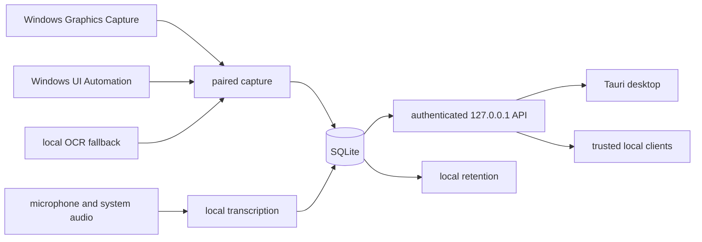

ScreenWise is a Windows-first Rust recorder with a Tauri desktop interface. Its
normal data path is entirely local.

## important boundaries

- capture, OCR, transcription, search, retention, and logs run locally
- local API bearer authentication remains enabled
- Pi chat, when provisioned, talks only to Ollama on loopback
- required tools and models are explicitly provisioned and checksum verified
- there is no product account, cloud sync, hosted AI gateway, pipe scheduler,
  service-connection facade, enterprise control plane, or automatic updater

## persistent data

The recorder stores metadata and searchable text in SQLite and stores captured
media below the selected data directory. The current ScreenWise schema is a
clean product baseline; migration from historical Screenpipe databases is not a
supported product requirement.

## source areas

| component | repository area |
| --- | --- |
| capture and OCR | `crates/screenpipe-screen`, `crates/screenpipe-capture` |
| audio and transcription | `crates/screenpipe-audio` |
| database and search | `crates/screenpipe-db`, `crates/screenpipe-engine` |
| desktop | `apps/screenpipe-app-tauri` |
| optional local MCP client | `packages/screenpipe-mcp` |
