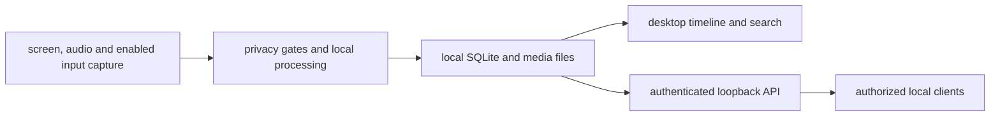

> **EXPERIMENTAL — NO PRIVACY OR SECURITY GUARANTEES.** Effort has been made to
> reduce network activity and filter sensitive content. These are aims and
> partially tested changes, not assurances. Neither the maintainer nor Digiwise
> guarantees the privacy, security, correctness or safety of this system or its
> code. Neither provides support or commits to maintenance or security fixes.
> Use synthetic or non-sensitive data; controls may fail and recordings may
> expose, retain or lose information.

## Intended data flow

ScreenWise derives its recording architecture from Screenpipe. This fork aims
for Windows capture and processing on the user's machine, with explicitly
provisioned local models and an authenticated loopback API.

This diagram describes the intended architecture. It does not prove complete
network isolation, effective redaction or protection from other local software.
A local client with access to recordings may handle them outside this design.
Build tools and explicit provisioning can use the network.

## Storage and sensitive data

The recorder's default data directory is `%USERPROFILE%\.screenpipe` on Windows.
A custom `--data-dir` selects another recorder store. It can contain SQLite data,
media, logs and the local bearer token. Do not publish these directories or paste
tokens into issue reports. Repository ignore rules are not access controls.

Keeping files on one machine does not protect them from account compromise,
other software, backups, exports or mistakes. Do not assume that screen, audio,
input or clipboard content is safe to record because storage is local.

## Controls and limits

- Keep local bearer authentication enabled and bind the recorder API to loopback.
- Review selected audio devices and input/clipboard settings before recording.
- Window exclusions, lock detection and redaction aim to suppress sensitive data;
  browser/custom controls, transitions and failure cases still need validation.
- Text redaction can miss secrets and does not establish protection of every
  screenshot, audio sample or stored representation.
- Retention and deletion behavior require their own verification; a missing
  search result alone does not prove secure erasure of all copies.
- A firewall rule or an absence of sampled sockets does not establish complete
  offline operation. Executables, child processes, protocols and routes need
  independent OS-level testing.

The root README and VALIDATION_REGISTER.md contain the current warning, scoped
results, known defects and outstanding tests. Historical upstream pages may
mention features removed from this fork; they are not ScreenWise capabilities
or privacy guarantees.

## Related page

- [local text redaction](/privacy-filter)
